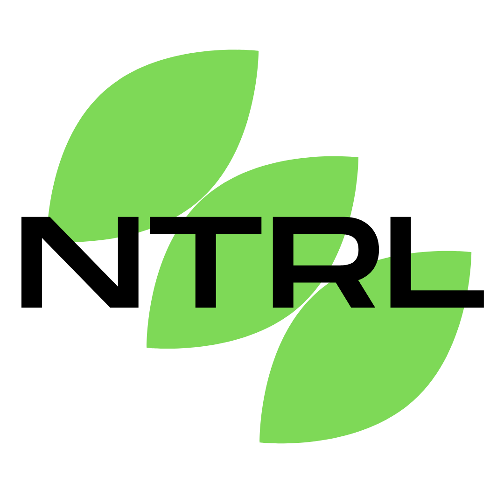
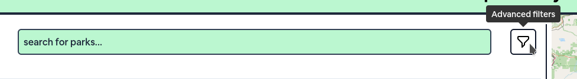
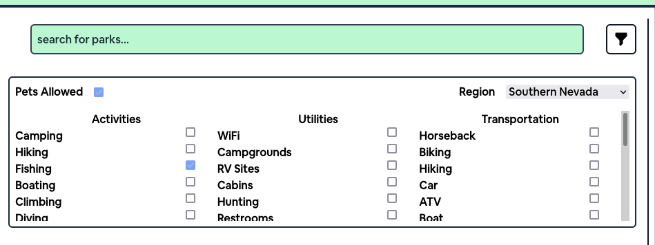

# NTRL

# Table of Contents
1. [App Description and Usage](#app-description-and-usage)
2. [Libraries Used](#libraries-used)
3. [Developer Guide](#developer-guide)

# App Description and Usage
## What is NTRL?
NTRL (pronounced "natural") is an application that allows Nevadans to search for parks, lakes, and rivers in their area. It is directed towards families looking to explore nature and the outdoors by giving them an easy interface from which they can filter parks based on their preference.

Users can filter for parks by:
- Name
- Pets allowed
- Utilities
- Activities
- Transportation
- Region

NTRL also uses the Google Maps api to allow users to quickly find directions to a specific park.
## Motivation
We wanted to create an application that met FBLA's criteria but also one that could actually be used by typical Americans, which led us to create a cross-platform application that does not require programming experience to actually use. We also made the decision to make our application source code open-source to allow anyone to contribute and propose changes/improvements to the application.
## How to use NTRL
A web version of NTRL is available at [https://ntrl.app/](https://ntrl.app/) and runs on most modern browsers. There is also a cross-platform desktop application that runs (and looks the same) on Linux, MacOS and Windows computers. Our desktop client is recommended to use because it does not rely on a browser, which itself can take up valuable PC resources.
### Filtering for parks
Users can just search for parks using the provided search box, but can also use advanced filters by selecting the drop-down.

# Libraries Used 
# Developer Guide

