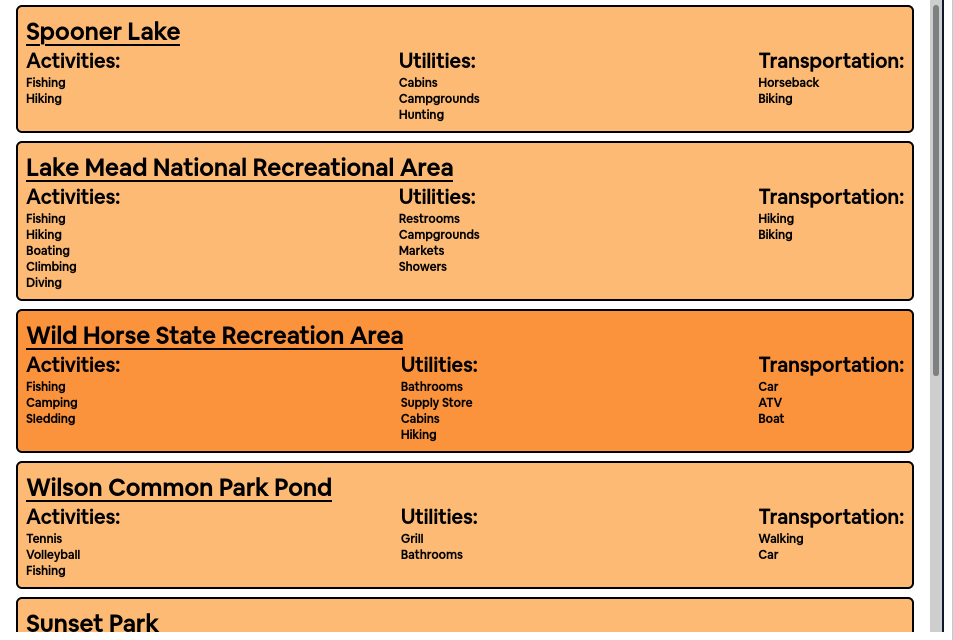
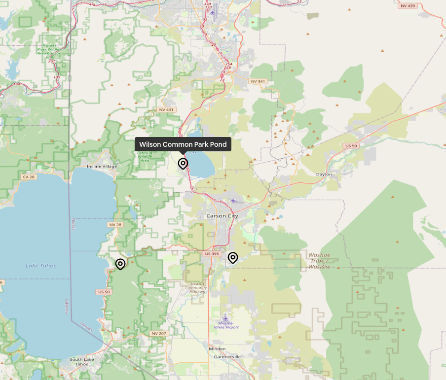

# NTRL


# Table of Contents
1. [App Description and Usage](#app-description-and-usage)
2. [Libraries Used](#libraries-used)
3. [Developer Guide](#developer-guide)

# App Description and Usage
## What is NTRL?
NTRL (pronounced "natural") is an application that allows Nevadans to search for parks, lakes, and rivers in their area. It is directed towards families looking to explore nature and the outdoors by giving them an easy interface from which they can filter parks based on their preference.

Users can filter for parks by:
- Name
- Pets allowed
- Utilities
- Activities
- Transportation
- Region

NTRL also uses the Google Maps api to allow users to quickly find directions to a specific park.
## Motivation
We wanted to create an application that met FBLA's criteria but also one that could actually be used by typical Americans, which led us to create a cross-platform application that does not require programming experience to actually use. We also made the decision to make our application source code open-source to allow anyone to contribute and propose changes/improvements to the application.
## How to use NTRL
A web version of NTRL is available at [https://ntrl.app/](https://ntrl.app/) and runs on most modern browsers. There is also a cross-platform desktop application that runs (and looks the same) on Linux, MacOS and Windows computers. Our desktop client is recommended to use because it does not rely on a browser, which itself can take up valuable PC resources.
### Filtering for parks
Users can just search for parks using the provided search box, but can also use advanced filters by selecting the drop-down.


### Analyzing displayed parks
Parks that match the user's specified criteria are displayed in a list on the left, which shows information for each park. On the right, there is an interactive map that displays the location of each park.



### Saving Data
Users can then choose if they want to save their park data locally to their machine. They can click on the "Save Data" button, which will then save the data in the user's default Downloads folder as a file named `data.json`. This file is both human and machine readable, allowing for easy analysis of data.

## Have an issue? 
You can use this repository's ***issues*** tab to submit app reports or suggest improvements of the application.
# Libraries Used 
- note: this section assumes some programming experience as specific terminology will be used.

We used a variety of free and open-source libraries to build our application.

## Development Environment 
This app was built using the GNU/Linux operating system, with the text editor VSCode. Our cloud-hosted server runs Ubuntu-20.04 server operating system.
## Node.js & TypeScript
The main language we used in our program is JavaScript. More notably, we used TypeScript, which is a superset of JavaScript with type restrictions that provide a better experience in both development and production because it helps catch errors early on and not through consumer reports.
For for information, visit the websites for [Node.js](https://nodejs.org/en/) and [TypeScript](https://www.typescriptlang.org/).
## Frameworks
Our application has two main components: the client and the server API. Here are the most important libraries and frameworks our ***client*** uses:
- [Vue.js](https://vuejs.org/) - Progressive JavaScript framework for building dynamic, reactive user interfaces.
- [Vite](https://vitejs.dev) - Frontend tooling for Frontend applications - sub-millisecond build times, easy compiling and fast hot-module reloads.
- [Tauri](https://tauri.studio) - Rust-based runtime for running web applications on native desktop windows.
- [TailwindCSS](https://tailwindcss.com) - CSS utility library for designing clean, aesthetic layouts.
- [Axios](https://axios-http.com/) - HTTP client used for communicating with our server.

Here are the libraries and platforms our ***server*** uses:
- [PostgreSQL](https://www.postgresql.org/) - Relational, scalable, secure database for open-source users.
- [Heroku](https://heroku.com) - Cloud-based deployment platform for hosting web servers. 
- [NestJS](https://nestjs.com/) - Node.js framework for building scalable and efficient server-side applications
- [Prisma](https://www.prisma.io/) - JavaScript object-relational mapper for communicating with databases.

# Developer Guide

This section provides documentation on contributing and compiling our app from source. We assume you have prior knowledge programming and writing code, and that you have **git**, **Node.js**, and **npm** installed.

## Cloning the Git Repository

```sh
$ git clone https://github.com/lmaosoggypancakes/ntrl -b app
$ cd ntrl
$ npm i
$ npm run dev # launches development server
```

## Compiling the application
```sh
$ npm run build
$ npm run tauri build # builds for your OS and CPU architexture
```
The command `npm run build` will first bundle up all the JavaScript and Vue.js into a few minified files. This helps reduce overall app size.

## Creating a new park
API URL: http://ntrl-fbla.herokuapp.com/

Developers interested in adding a new park in the database can do so with any library they see fit. We recommend using [Hoppscotch](https://hoppscotch.io) because it provides a nice visual interface for making API requests. Otherwise, you may use any HTTP library like cURL, Axios, etc.

### GET /
Returns, in JSON, an array of all parks.
```json
[
    {
        "id": 1,
        "title": "Valley of Fire State Park",
        "dogabble" :true,
        "activities": ["Camping","Hiking"],
        "transportation": ["Horseback","Biking"],
        "region":"Southern",
        "utilities": ["WiFi","Campgrounds","RV Sites"],
        "x":36.4913409,
        "y":-114.5814101
        }, 
        ...
]
```
### POST /
Submit data using a POST request to the root URL to add a new park. Your data should follow this schema:
```json
{
    title: string,
    dogabble: boolean,
    activities: string[],
    transportation: string[],
    region: string,
    utilities: string[],
    x: number,
    y: number
}
```
Otherwise, the server will throw an `HTTP 400`, indicating you sent a bad request with malformed data.